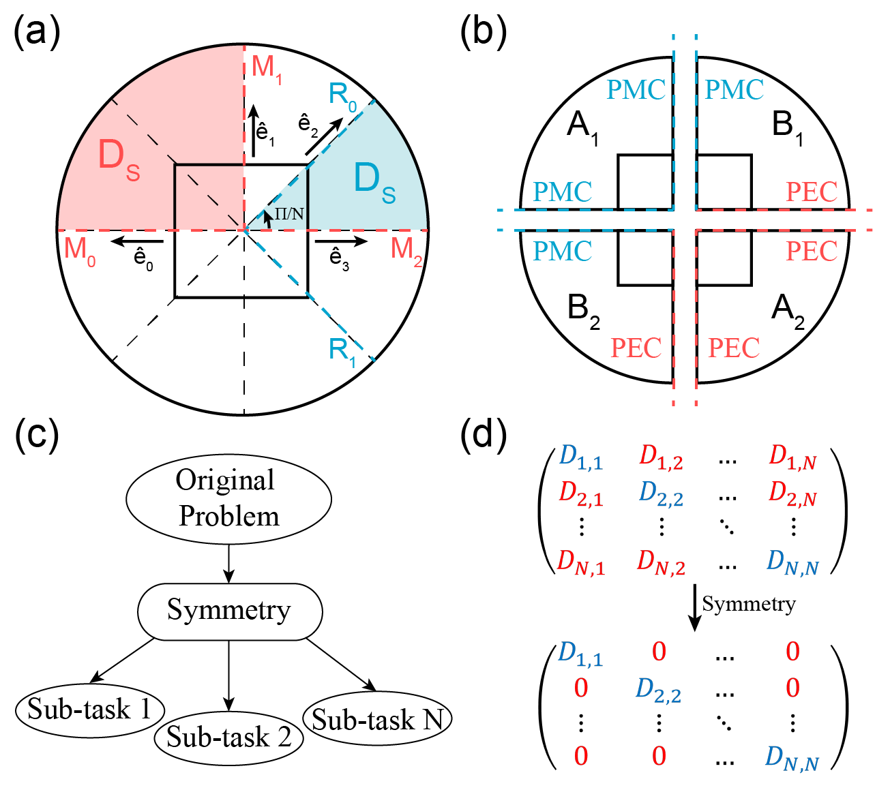

# Combined-symmetry-adapted-finite-element-modeling

## Overview
The open-source MATLAB package Combined Symmetry adpated FEM is an optical FEM program for modal analysis. Based on the symmetry in group theory, it enables truncation of the original computational domain, allowing the eigenmodes to be obtained by simulating only a part of the photonic structures. This program significantly improves the efficiency of modal analysis. In addition to the combined symmetry FEM program, we also provide standard  FEM programs.

The essence is to decompose the originally large photonic modelling problem into several decoupled sub-tasks, which are subsequently used to fully recover the original problem. Such irreducible decompositions and complete enclosure between sub-tasks and the original problems are guaranteed by irreducible representations and enclose property of symmetry group, which lies at the heart of our approach. Furthermore, our method classifies the eigenmodes directly based on symmetry, with one category of eigenmode corresponding to one sub-task, which is beneficial for analyzing and designing waveguide modal characteristics.

## Usage
### Functions for basic function
1. `function/BF_Et.m`: Vector basis functions are provided.
2. `function/BF_curlEt.m`:The curl of the vector basis function is provided.
3. `function/BF_Ez.m`:Scalar basis function is provided.
4. `function/BF_gradEz.m`:The gradient of the scalar basis function is provided.

### Functions for Gauss numerical integration
`function/GetGuassPoints.m`:The Gauss integral points of the triangular surface are provided.

### Function for getting COMSOL's mesh data
1. `Main_GetMeshData.m`:Read the mesh data of COMSOL project and save it as .mat file. Of course, you can also use other methods to generate mesh data.
2. `mesh/GetEdge.m`:Get information about the edges of the triangular meshes.
3. `mesh/FindIndex.m`:A Function to find a specific ID edge.

### Kernel function for matrix assembly
1. `kernel/Assemble_standardFEM.m`:Used for standard FEM matrix assembly and Cnv-FEM matrix assembly.
2. `kernel/Assemble_standardFEM_PEC.m`:PEC boundary condition processing for standard FEM.
3. `kernel/Assemble_CnvFEM_Degenrate.m`:Used for matrix assembly when combining mirror symmetry and rotational symmetry.

### Main function of FEM
1. `Main_StandardFEM.m`:Main function of standard FEM.
2. `Main_PTsymmetryFEM.m`:Main function when combining mirror symmetry and PT symmetry.
3. `Main_CnvFEM_Degenerate.m`:Main function to analyze degenerate modes when combining mirror symmetry and rotational symmetry.
4. `Main_CnvFEM_NonDegenerate.m`:Main function to analyze non-degenerate modes when combining mirror symmetry and rotational symmetry.

## Run examples
1. Run the script `Main_StandardFEM.m`/`Main_PTsymmetryFEM.m`/`Main_CnvFEM_Degenerate.m`/`Main_CnvFEM_NonDegenerate.m`.
2. Run the COMSOL file `HollowCoreFiber.mph`/`WaveguideWithPT.mph` and compare the results.
